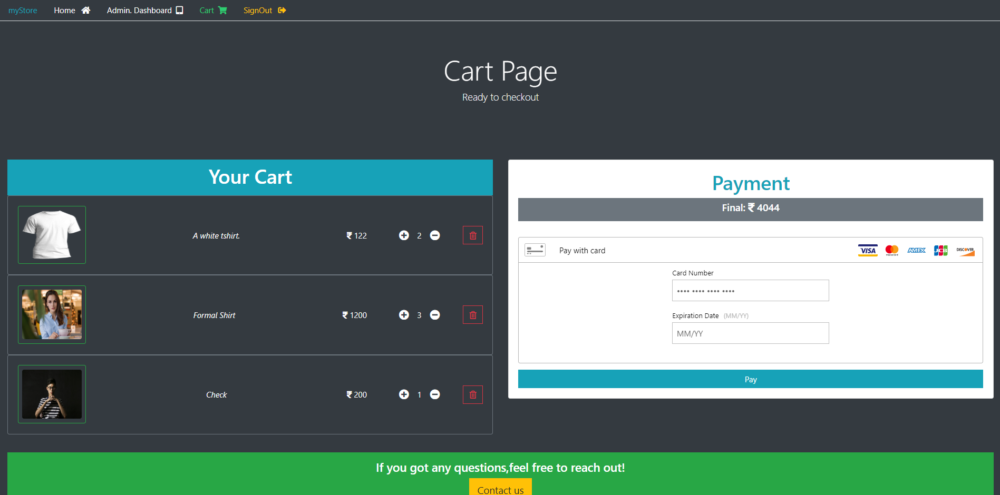

# MyStore

### An e-commerce web application built using reactjs ,nodejs ,express and mongodb

>## Description

The application is built using MERN stack. It uses React for the front-end and Nodejs for backend

User can signin,signup and signout.Any user can choose various products and view them in their cart , where they can make their online payments too.
Online payment is being implemented using brainTree.

Here are some screenshots of various pages:
>## Screenshots

## Sign in

## Sign out

## Home

## Cart

## Admin Dashboard

## Admin -Add Product

***
